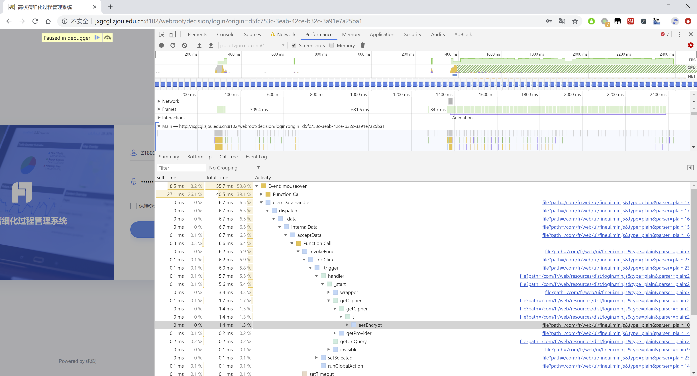
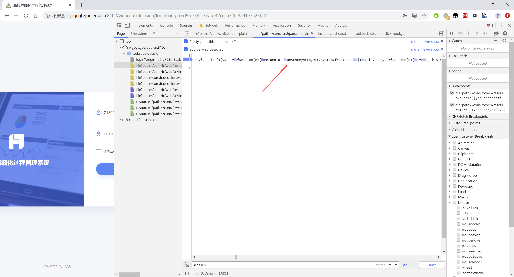
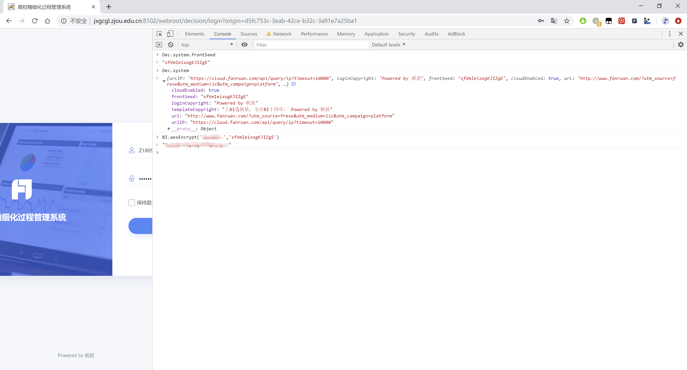
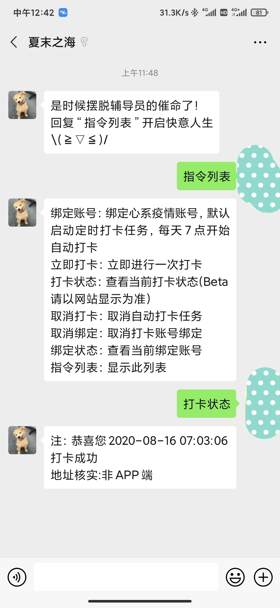

# 前言

疫情都已经过去了还要每天打卡真的是不胜其烦，偶尔忘记还会被辅导员催命。反正也不让出去，干脆写个自动打卡的程序好了。

# 思路

基本思路很简单，开始想的就是先模拟登录然后提交表单打卡，crontab定时执行就行了呗，但是实现起来却没有想的那么容易。纸上得来终觉浅，绝知此事要躬行啊。

# 开工

1. 找接口

   登录页面 F12，本来想着这登录应该就是 POST 个表单吧。结果仔细一看才发现，好家伙，全部 JS 实现。没错，就是页面的内容全部都是 JS 填充的，CSS 样式全写在行内看的我脑壳痛，找遍整个页面就看见俩 input，根本没有表单的影，那应该就是 Ajax 发请求了。继续 F12 抓包，过滤 Type 为 xhr 请求，很容易就找到了 POST 的表单。心想着登录这算搞定了吧，然而定睛一看，提交的用户名是明文，密码却是一串乱码，很明显是经过 JS 加密了的。看到这不禁倒吸了一口凉气，它要是搞个啥奇葩加密算法那可就麻烦了，因为 JS 文件都是压缩过的，可读性非常差。那咋办呢，好在 Chrome 有一个录制的功能，可以记录录制开始到结束发生的所有事件，加密这个过程只能是在填完密码到发送请求之间完成的，那么要么是密码框 input 的离焦事件，要么是登录按钮的点击事件，后者的可能性更大。后续排查也证实，input 确实没有离焦事件。断网，开始录制，点击登录按钮，结束录制，查看调用树，果然发现了蛛丝马迹。

   

   点击事件后调用了一个叫 aesEncrypt 的方法，Reveal in Sources panel，

   

   发现这个方法有两个参数，后者看起来是一个常量，那么前者应该就是输入的密码明文，打开 Console 验证，手动调用该方法，果然得到了和 POST 请求中相同的密文。

   

   有了加密key，几种AES加密方式都尝试一下很快就找到了加密的参数。

   **AES加密模式：ECB**

   **填充：pkcs5padding**

   **数据块：128位**

   **密码：sfVmIeixogKJIZgE**

   **输出：base64**
   
   接下来的过程和预想的基本一致，拿到 cookie，提交表单即可完成打卡。
   
2. 面向百度编程

   因为前段时间看前端的时候学了点 PHP，所以正好拿这个来练练手。

   GitHub: xxx

3. 接入微信公众号

   独乐乐不如众乐乐，为了方便分享给同学使用，封装成 api 供微信公众平台调用

   

